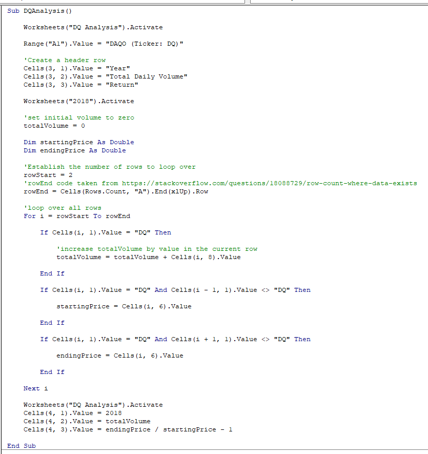
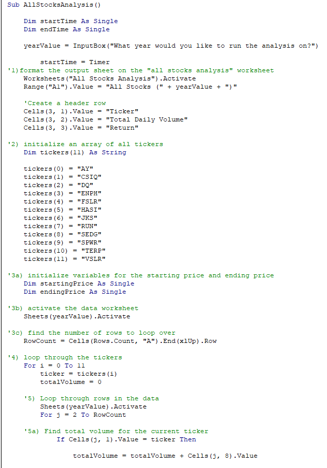
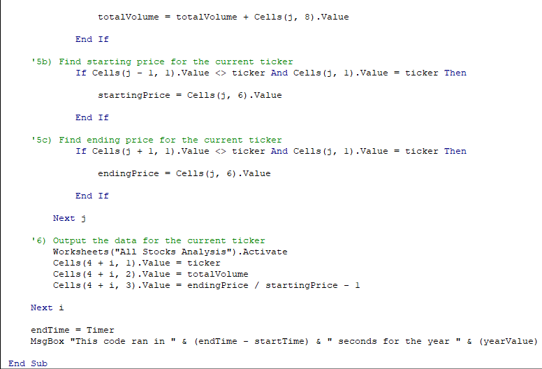
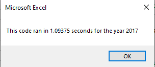
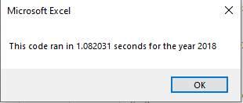
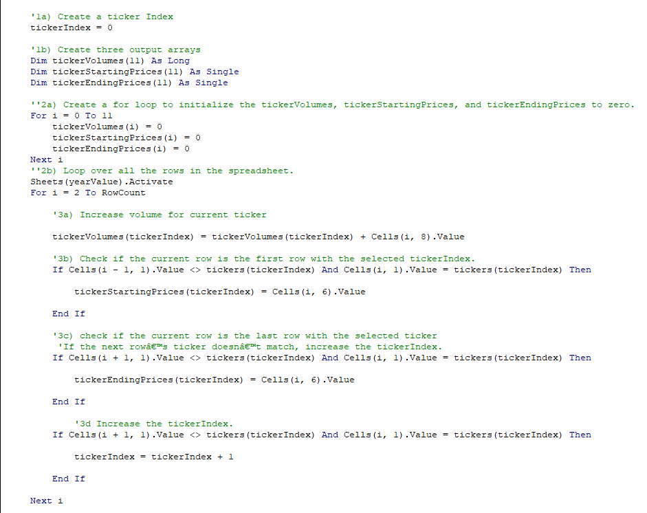
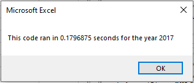
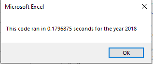

# VBA Stock Analysis

## Overview

Steve just graduated with his finance degree and his parents become his first clients. They're passionate about alternative energy and want to invest all their funds into "DQ", but Steve wants them to have a diverse portfolio.  

## Purpose

Steve wanted to give his parents a detailed breakdown for how the DQ stock performed, but also analyze other green energy stocks so his parents would see the value in diversifying their portfolio. I was hired to assist in the analysis.

## Results

### DQ Analysis

Initially, I analyzed the most recent DQ stock performance as Steve's parents requested. I created header rows on the output sheet for the 2018 data, set the total volume to zero, and established the starting and ending stock prices as type "double" to show two places past the decimal point. Next I had to tell the macro which rows to analyze within the 2018 data sheet - row 2 was the starting point, which I set as "rowStart", but to find the last row containing data I had to use a function from stack overflow. I used a "for" loop to loop through all the rows containing DQ info, and output the results to the DQ Analysis worksheet. The results showed that DQ had a fairly sizeable volume traded, but the return for 2018 was negative, so I advised Steve that his parents should not invest everything into DQ.

### All Stocks Analysis

Next I analyzed all 12 of the green energy stocks using similar logic, only this time I used an array to store all the tickers as the macro looped through the data in the sheets for each ticker. The main loop "i" looped through each ticker within the array, and the nested loop "j" looped through all the rows in the respective year's data sheet, which could be entered using an input box. I also used a timer because Steve was interested in potentially using the macro for analyzing additional stocks beyond these 12, so a good time would indicate my code was sound and could be used again. The time for both years was over 1 second though, so I decided to refactor the code to improve the time.

### All Stocks Refactored

In the refactored code I decided to still use an array for all the tickers, but also defined 3 additional arrays for each ticker's volume, starting price and ending price. 

I used a "for" loop to set each of the sub-arrays' initial values to zero, then another loop to go through all the rows of data, same as before. The difference this time was using the sub-arrays as the variables for the loop, and the tickerIndex as the variable for each array since "i" was being used to loop through the rows. This ended up running much faster than the initial code because instead of having to check all the rows of data before outputting the result, the refactored code stored the extracted data within arrays that were much smaller than the overall data, and then outputted the results of the arrays. 

## Summary

Refactoring code can lead to better results as it did in this case, but a potential drawback is getting led down a rabbithole trying to find a better solution and ending up stuck. The advantage of refactoring this code was that it ended up running much faster, but the logic was more complicated and the code itself was longer. 